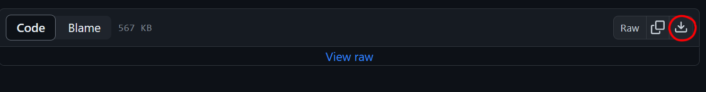

# Restaurang Kassasystem

## Download the system

[Click here for download](installer/POSS-Installer.msi)

* Go to the link above
* Press the download button as shown in the image below

* When the installer has been run find the location of the installed .exe
* Right click the .exe and click "Run as administrator"

## Programming languages
* C# version 12
* .NET version 6.0.202

## Coding standard
* [Naming conventions](https://learn.microsoft.com/en-us/dotnet/csharp/fundamentals/coding-style/identifier-names)
* [Coding conventions](https://learn.microsoft.com/en-us/dotnet/csharp/fundamentals/coding-style/coding-conventions)

## Standardized development environment
* Visual Studio 2022 version 17.8.0
* WPF 3.0.6920.4902
* FlaUI version 4.0.0
* FlaUInspect

## Further documentation

[documentation](documentation/documentation.md)
