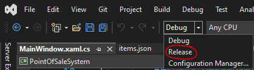

# Manage the installer

## Install the extension

* In Visual Studio go to the extensions tab at the top of the window.
* Click `Manage Extensions` and search for `Microsoft Visual Studio Installer Project`, then download and follow its steps after closing Visual Studio.
* You may have to reload the POSS-Installer project to make changes to it.

## Setup the installer

* Build the PointOfSaleSystem project
* Build the POSS-Installer project

**Note: if it says (incompatible) reload the project with dependencies by right clicking the solution and press "Reload with dependencies"**

To find the installer you go to POSS-Installer folder then Debug or release depending on your Visual Studio settings, then run the POSS-Installer.msi

## Update installer versions

When the project has been updated you need to update the version of the installer, for the installer to be able to update the program.

* Set the mode in Visual Studio from debug to release

* Build PointOfSaleSystem project
* Right click the POSS-Installer project, click add then file and select `PointOfSaleSystem.deps.json` from the PointOfSaleSystem project
* Build the POSS-Installer project
* Click the POSS-Installer in Visual Studio and press F4
* The properties window will open
* Scroll down to the version tab and update the version

### Make the installer accessible
* Navigate to the installer and copy the POSS-Installer.msi and setup.exe files.
    * Should be located at `/PointOfSaleSystem/POSS-Installer/Release/`
* In the installer folder, place the new POSS-Installer.msi and setup.exe files.