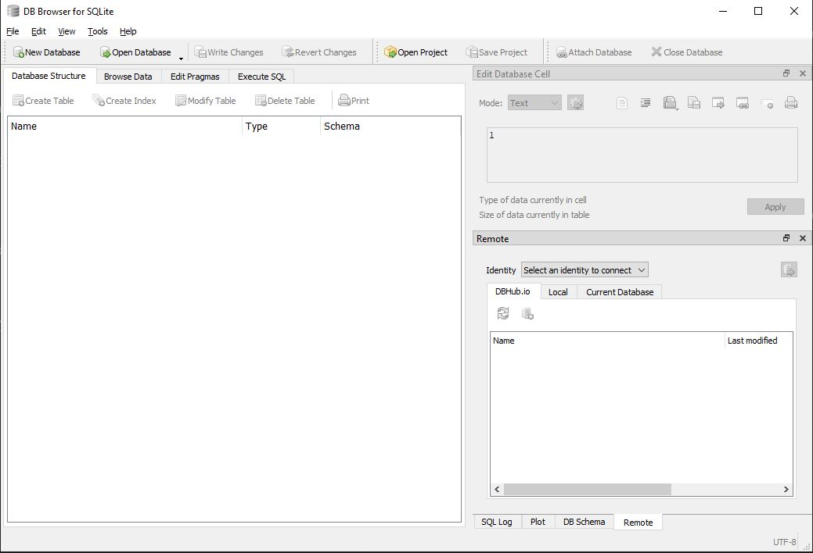

# Setup database

## Database from default

* When the program is run without an existing database a database is created from a `.txt` file

* The `.txt` files separates values by the keyword "_SPLIT_HERE_"

* One is located in the `PointOfSaleSystem` project and the other in the `TestSystem` project

* The `.txt` file is chosen by the `.env` file located in the same folder

## DB Browser

1. Download DB Browser [Here](https://sqlitebrowser.org/dl/) and install it

    It should look like this 

2. Click "Open Database" and select its location

3. Navigate to the existing database
    * If program has been run the database will be created at `C:\Users\%UserName%\AppData\Local\Restaurant-POS\`

4. To add products you can go into the SQL tab and write the following line (change the sent values. priority is 0 to 10 where 10 is the highest priority, isCommon is 1 for true or 0 for false) 
    ``` SQL
    INSERT INTO products (product, price, categoryId, priority, isCommon) VALUES ('ProductName', 20, 1, 5, 1);
    ```

5. To add categories you can go into the SQL tab and write the following line (change the sent values. Colors are taken from [Here](https://learn.microsoft.com/en-us/dotnet/api/system.windows.media.colors?view=windowsdesktop-8.0#remarks)) 
    ``` SQL
    INSERT INTO categories (name, color) VALUES ('CategoryName', 'Red');
    ```
