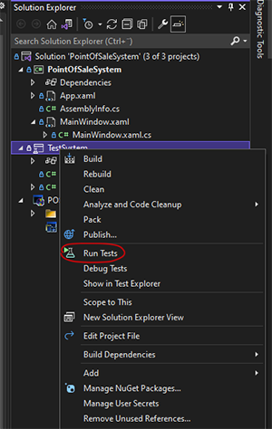

# How to run tests
FlaUI needs to be installed to the test project in the solution
* Open the solution in Visual Studio
* Run and close the PointOfSaleSystem project in debug mode
* Right click TestSystem and click "Run Tests"

    